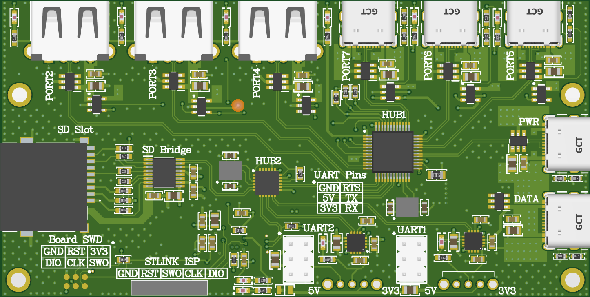
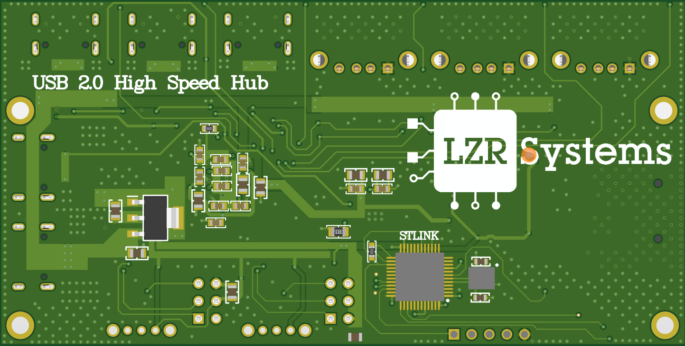
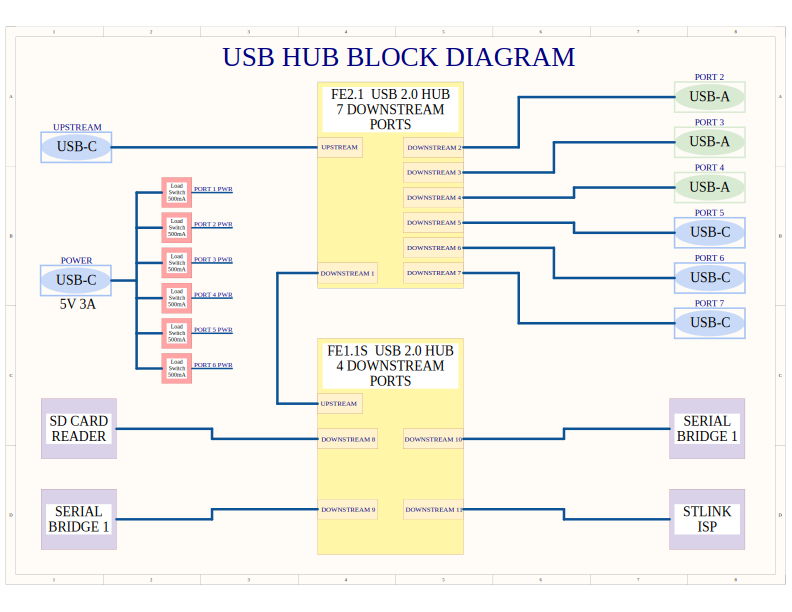
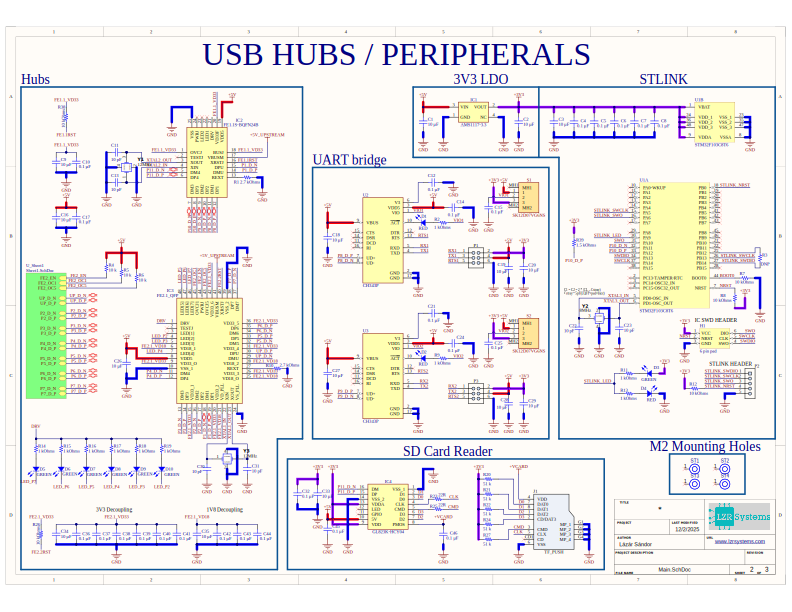
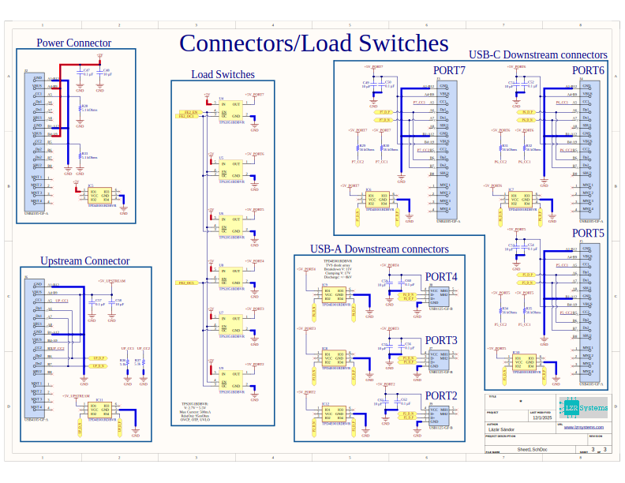

---
tags:
  - PCB
  - Altium
---


### USB 2.0 High-Speed Hub is a **professional development hub** with integrated programming tools and peripherals. It combines a 7-port USB 2.0 hub with ST-Link programmer, dual UART bridges, and SD card reader into a single compact device for embedded development workflows.

## 🚀 Features

### Main Hub Architecture
- **Primary Hub**: FE2.1 USB 2.0 Hub IC (7 downstream ports)
- **Secondary Hub**: FE1.1S USB 2.0 Hub IC (4 downstream ports, cascaded)
- **Total Ports**: 11 USB endpoints (6 external + 4 internal peripherals + 1 upstream)
- **External Connectors**:
  - 3× USB-C downstream ports (Ports 5, 6, 7)
  - 3× USB-A downstream ports (Ports 2, 3, 4)
  - 1× USB-C upstream port (host connection)
  - 1× USB-C power input (5V 3A)

### Integrated Development Tools
- **ST-Link V2 Programmer**: STM32F103C8T6-based in-circuit debugger
  - SWD interface (SWCLK, SWDIO, SWO)
  - Compatible with STM32, STM8 targets
  - Onboard programming via 5-pin header
  - Status LED indicator
- **Dual UART Bridges**: 2× CH343P USB-to-Serial converters
  - Selectable 3.3V / 5V logic levels (via toggle switches)
  - Hardware flow control (RTS/CTS)
  - 6-pin headers (GND, VCC, TX, RX, RTS, DTR)
  - Individual activity LEDs
- **SD Card Reader**: GL823K-based MicroSD card interface
  - Push-pull card slot
  - Hot-swap capable
  - USB 2.0 High-Speed transfer

### Power Management
- **Individual Port Protection**: TPS2051BDBVR load switches (500mA per port)
  - Overcurrent protection
  - Thermal shutdown
  - Inrush current limiting
  - Enable control via hub IC
- **USB-C Power Delivery**:
  - Downstream ports: 56kΩ CC resistors (advertises 500mA)
  - Upstream port: 5.1kΩ CC resistors (UFP/sink configuration)
- **Voltage Regulation**:
  - AMS1117-3.3 LDO for 3.3V peripherals
  - Separate power domains for hub ICs (3.3V, 1.8V)

### Protection Circuitry
- **ESD Protection**: TPD4E001 TVS diode arrays on all USB ports
  - ±8kV contact discharge protection
  - Clamping voltage: 17V
  - Protects D+, D-, CC1, CC2 lines
- **Port Activity LEDs**: 6× green indicator LEDs (1 per external port)

## 🔧 Hardware

### PCB Specifications
- **Layers**: 4-layer stackup
  - L1: High-speed signals, components (1oz copper)
  - L2: Solid ground plane (1/2oz copper, 0.0994mm prepreg)
  - L3: Ground + power pours (1/2oz copper)
  - L4: Power distribution, decoupling (1oz copper)
- **Impedance Control**: 
  - USB differential pairs: 90Ω ±10% (0.165mm trace, 0.2mm gap)
  - USB-C CC lines: 50Ω single-ended
- **Dimensions**: ~100mm × 70mm
- **Mounting**: 4× M2.5 mounting holes

### PCB 3D Renders



### 📐 Schematics
**Block Diagram:**


**Main Schematic - Hubs & Peripherals:**


**Connectors & Load Switches:**


## 🔌 Port Mapping

### External Ports (User-Accessible)
| Port&nbsp; &nbsp; &nbsp; &nbsp; &nbsp; &nbsp; &nbsp; &nbsp;  | Connector &nbsp; &nbsp; &nbsp;| Hub IC&nbsp; &nbsp; &nbsp; &nbsp;  | Downstream # | Features |
|------|-----------|--------|--------------|----------|
|------|-----------|--------|--------------|---------------------------------|
| **PORT 2** | USB-A | FE2.1 | &nbsp; &nbsp; &nbsp; &nbsp; DS2 | 500mA protected, activity LED |
| **PORT 3** | USB-A | FE2.1 |&nbsp; &nbsp; &nbsp; &nbsp;  DS3 | 500mA protected, activity LED |
| **PORT 4** | USB-A | FE2.1 |&nbsp; &nbsp; &nbsp; &nbsp;  DS4 | 500mA protected, activity LED |
| **PORT 5** | USB-C | FE2.1 |&nbsp; &nbsp; &nbsp; &nbsp;  DS5 | 500mA protected, activity LED |
| **PORT 6** | USB-C | FE2.1 |&nbsp; &nbsp; &nbsp; &nbsp;  DS6 | 500mA protected, activity LED |
| **PORT 7** | USB-C | FE2.1 |&nbsp; &nbsp; &nbsp; &nbsp;  DS7 | 500mA protected, activity LED |

### Internal Peripherals (Soldered)
| Peripheral&nbsp; &nbsp; &nbsp;&nbsp; &nbsp; &nbsp;&nbsp; &nbsp; &nbsp; | Hub IC&nbsp; &nbsp; &nbsp; | Downstream #&nbsp; &nbsp; &nbsp; | Interface |
|------------|--------|--------------|-----------|
|------------|--------|--------------|--------------------------------------------|
| **ST-Link ISP** | FE1.1S |&nbsp; &nbsp; &nbsp; &nbsp;  DS10 | 5-pin header (GND, RST, SWO, CLK, DIO) |
| **UART Bridge 1** | FE1.1S |&nbsp; &nbsp; &nbsp; &nbsp;  DS10 | 6-pin header + 3.3V/5V switch |
| **UART Bridge 2** | FE1.1S |&nbsp; &nbsp; &nbsp; &nbsp;  DS9 | 6-pin header + 3.3V/5V switch |
| **SD Card Reader** | FE1.1S |&nbsp; &nbsp; &nbsp; &nbsp;  DS8 | Push-pull MicroSD slot |

## ⚙️ Technical Specifications

### USB Hub Controllers
**FE2.1 (Primary Hub)**
- Package: LQFP-48
- Downstream ports: 7
- Overcurrent detection: Grouped (OVCJ1, OVCJ5)
- Crystal: 12MHz
- Power: 3.3V (digital), 1.8V (analog), 5V (VBUS)

**FE1.1S (Secondary Hub)**
- Package: BQFN-24
- Downstream ports: 4
- Cascade connection to FE2.1 port 1
- Crystal: 12MHz
- Power: 3.3V, 5V (VBUS)

### Load Switches (TPS2051BDBVR)
- Input voltage: 2.7V - 5.5V
- Current limit: 500mA (hardware)
- Rds(on): 95mΩ typical
- Features: OVCP, OTP, UVLO
- Package: SOT-23-5

### UART Bridges (CH343P)
- Package: TQFN-16
- Data rates: up to 6Mbps
- Logic levels: 1.8V - 5.5V (selectable via VIO)
- Pins: TX, RX, RTS, CTS, DTR, DSR, DCD, RI
- Crystal: 12MHz

### ST-Link Programmer (STM32F103C8T6)
- Package: LQFP-48
- Flash: 64KB
- RAM: 20KB
- Crystal: 8MHz

### SD Card Reader (GL823K)
- Interface: USB 2.0 High-Speed
- Card support: SD, SDHC, SDXC (MicroSD format)
- Hot-swap: Yes
- Power: 3.3V + 5V (card power selectable)

## 🛠️ Usage

### Basic Operation
1. **Power Connection**: 
   - Connect 5V 3A power supply to power USB-C connector
   - Alternative: Power via upstream USB-C (limited to USB spec current)

2. **Host Connection**:
   - Connect upstream USB-C port to computer
   - Hub enumerates as USB 2.0 High-Speed device
   - All ports become available

3. **UART Bridge Configuration**:
   - Toggle S1/S2 switches to select 3.3V or 5V logic levels
   - Connect target via 6-pin headers
   - Bridges enumerate as CH343 serial ports

4. **ST-Link Programming**:
   - Connect target via 5-pin SWD header (or dedicated STLINK_ISP header)
   - Use STM32CubeIDE, Keil, or OpenOCD
   - Status LED indicates connection

### UART Pinouts
```
PIN 1: GND
PIN 2: RTS (output from bridge)
PIN 3: 5V or 3.3V (selectable via switch)
PIN 4: TX (output from bridge)
PIN 5: 3.3V (always)
PIN 6: RX (input to bridge)
```

### ST-Link SWD Pinout (5-pin header)
```
PIN 1: VCC (3.3V output to target)
PIN 2: SWCLK
PIN 3: GND
PIN 4: SWDIO
PIN 5: NRST (reset)
PIN 6: SWO (optional, for SWV trace)
```

### Onboard Programming Header (6-pin, 1.27mm pitch)
```
PIN 1: VCC (3.3V)
PIN 2: SWCLK
PIN 3: GND
PIN 4: SWDIO
PIN 5: NRST
PIN 6: SWO
```

## ⚠️ Important Design Notes

### USB-C CC Resistor Configuration
- **Downstream ports (host)**: 56kΩ pull-ups to VBUS
  - Advertises default USB power (500mA)
- **Upstream port (device)**: 5.1kΩ pull-downs to GND
  - Configures as UFP (sink/device role)

### STM32F103 USB Pull-up
The STM32F103C8T6 requires an **external 1.5kΩ pull-up resistor** on D+ (PA12) to 3.3V. This is different from newer STM32 families (F4, G4, etc.) which have internal pull-ups.

**In schematic**: R39 = 1.5kΩ from PA12 to +3V3 ✓

### Crystal Load Capacitors
All crystals use **10pF load capacitors** (C0G/NP0 type):
- Formula: C_load = 2 × (CL - C_stray)
- C_stray ≈ 5pF (LQFP package + PCB traces)
- Therefore: C_load = 2 × (10pF - 5pF) = 10pF

**Critical**: Verify all crystals are specified for CL = 10pF (especially the 8MHz for STM32).

### Power Sequencing
1. 5V input powers load switches and hub VBUS pins
2. AMS1117-3.3 generates 3.3V for logic
3. Hub ICs generate internal 1.8V for analog/PLL
4. All power rails must be stable before USB enumeration

### High-Speed USB Routing
- Differential pairs: 90Ω impedance, length matched ±2mm
- Trace geometry: 0.165mm width, 0.2mm gap
- Reference plane: Solid GND on L2 (0.0994mm away)
- Via fencing around connectors for EMI suppression
- TVS diodes placed <3mm from connectors

## 📦 Manufacturing

### PCB Fabrication Specs
```
Layers:           4
Board thickness:  1.6mm
Copper weight:    1oz outer, 1/2oz inner
Min trace/space:  6/6 mil (0.15/0.15mm)
Min hole size:    0.3mm
Surface finish:   ENIG (recommended) or HASL
Impedance:        Controlled (90Ω diff, 50Ω SE)
Solder mask:      Green (or choice)
Silkscreen:       White both sides
```

### Assembly Notes
- **Reflow profile**: Standard SAC305 lead-free
- **Via-in-pad**: Plugged/tented recommended under ICs
- **USB-C connectors**: Mechanical holes provide strain relief
- **Thermal vias**: Required on exposed pads (TPS2051B, CH343P, hub ICs)

### BOM Summary
- **Main ICs**: 7 (2× hub, 2× UART, 1× STM32, 1× SD, 1× LDO)
- **Load switches**: 6× TPS2051BDBVR
- **TVS diodes**: 8× TPD4E001RDBVR (32 protection lines total)
- **Crystals**: 4× (3× 12MHz, 1× 8MHz)
- **Connectors**: 7× USB-C, 3× USB-A, various headers
- **Passives**: ~110 (resistors, capacitors, LEDs)

### Design Considerations for Future Revisions
- Add test points for critical signals (+5V, +3.3V, FE2_EN, OC pins)
- Consider upgrading L3 copper from 1/2oz to 1oz for better power handling
- Evaluate adding USB 3.0 capability (requires different hub IC)
- Optional: Add USB-PD negotiation IC for higher power delivery

## 📚 Resources

### Datasheets
- [FE2.1 USB Hub Controller](https://datasheet.lcsc.com/lcsc/1912111437_Terminus-Tech-FE2-1_C429766.pdf)
- [FE1.1S USB Hub Controller](https://www.farnell.com/datasheets/2862638.pdf)
- [TPS2051B Load Switch](https://www.ti.com/lit/ds/symlink/tps2051b.pdf)
- [TPD4E001 TVS Array](https://www.ti.com/lit/ds/symlink/tpd4e001.pdf)
- [CH343P UART Bridge](http://www.wch-ic.com/products/CH343.html)
- [GL823K SD Card Reader](https://www.genesyslogic.com/en/product_view.php?show=43)
- [STM32F103C8T6](https://www.st.com/resource/en/datasheet/stm32f103c8.pdf)

### Application Notes
- [STMicroelectronics TA0357: USB hardware guidelines](https://www.st.com/resource/en/technical_note/tn0357-usb-hardware-and-pcb-guidelines-using-stm32-mcus-stmicroelectronics.pdf)
- [USB Type-C Resistor Configuration Guide](https://www.usb.org/usb-type-cr-cable-and-connector-specification)
- [High-Speed USB Layout Guidelines](https://www.ti.com/lit/an/slla414/slla414.pdf)

### Tools
- **PCB Design**: Altium Designer
- **Programming**: STM32CubeIDE, OpenOCD, st-link tools
- **Serial Terminal**: PuTTY, TeraTerm, minicom

## 📄 License

This hardware design is released under:
- **Hardware**: CERN Open Hardware Licence Version 2 - Permissive (CERN-OHL-P)

You are free to use, modify, and distribute this design for personal or commercial purposes. Attribution is appreciated but not required under the permissive license.

## 🚧 Project Status

**Current Status**: ✅ Design Complete, 🔄 PCB Ordered, ⏳ Awaiting Manufacturing

- [x] Schematic design
- [x] PCB layout
- [x] Design rule check (DRC)
- [x] Bill of materials
- [x] Gerber generation
- [ ] PCB fabrication (in progress)
- [ ] Assembly
- [ ] Testing & validation
- [ ] Firmware development
- [ ] Documentation completion

---

**Last Updated**: January 2026 | **Rev**: 1.0  