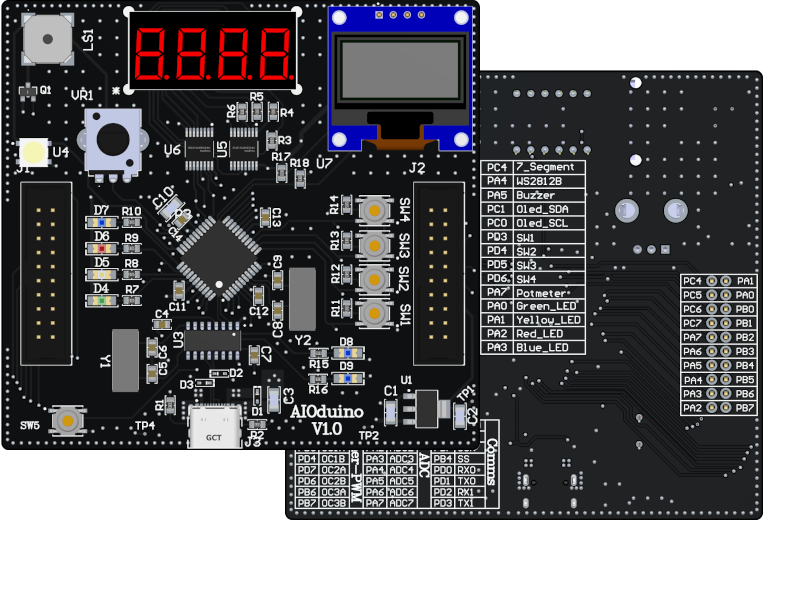
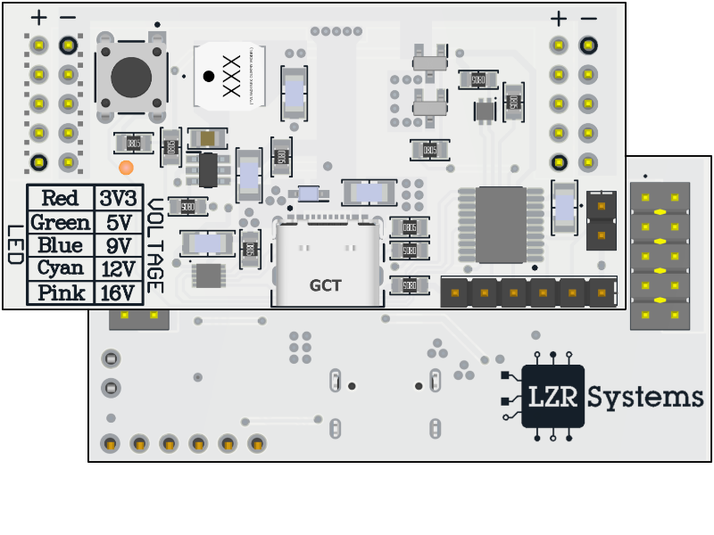

# Projects

-  

    ATmega1284P based Dev board with perepherals.    

-  

    BLE enabled Programmable power supply.    

-  

    Solderless breadboard compatible PSU.      

-  

    ESP-NOW based model rocket launch controller

-  

    ???

-  

    Small form factor CV/CC benchtop power supply

-  

    USB-C IN 2xUSB-C 3.0, 2xUSB-A 3.0 OUT

-  

    Adjustable Water Cooled Electronic Load

