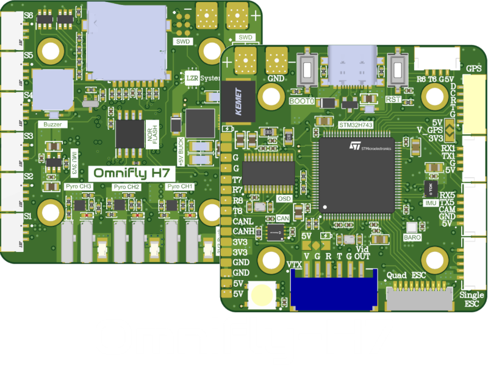
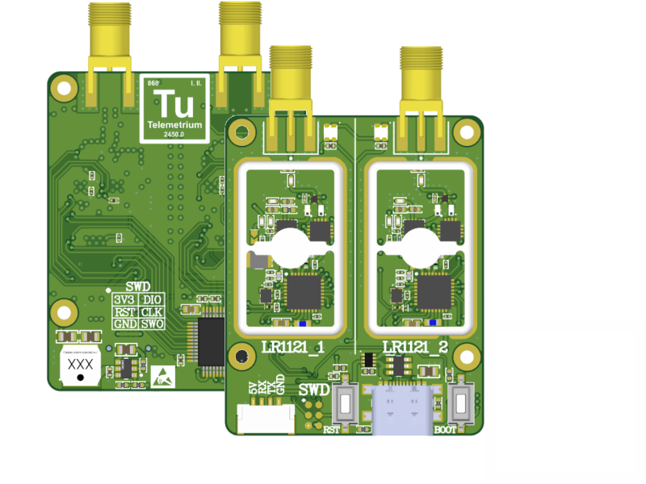
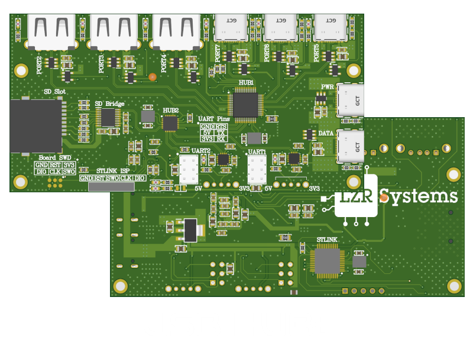
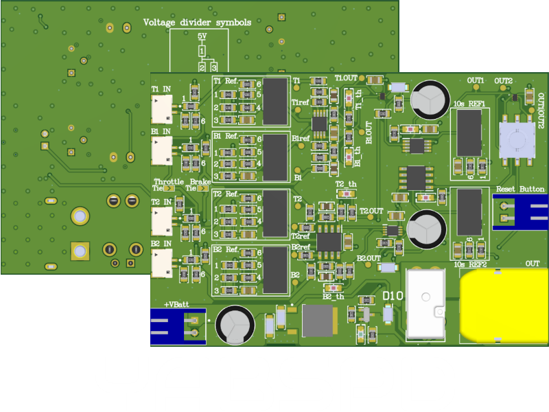
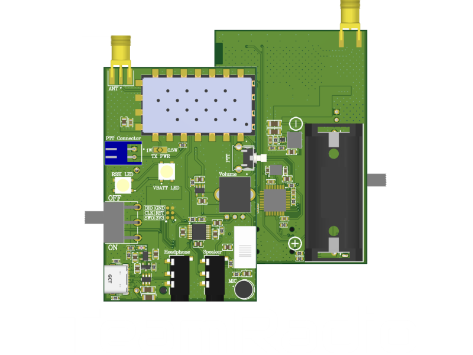
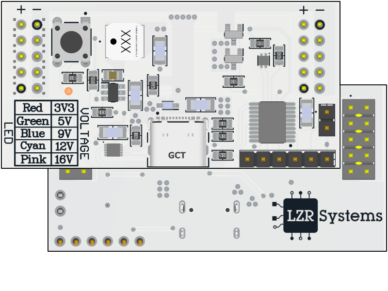
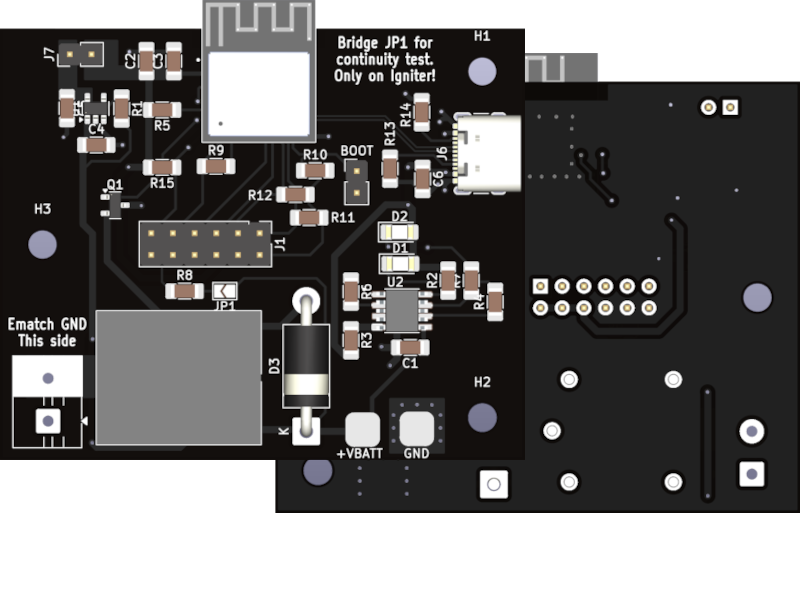

# Projects

-  

    Swiss army knife of flight controllers

-  

    Dual-Band Full-Duplex long range telemetry link

-  

    3xUSB-C, 3xUSB-A, 2xUART, microSD, STLink  

-  

    Yet Another BSPD

-  

    1W UHF Radio with MIC and headphone AMP

-  

    LoRa enabled 38kHz IR Gate for timing applications

-  

    SMA converter and matching network tester with RF switch

-  

    PCB Business Card

-  

    USB-C PD male to JST XH

-  

    ATmega1284P based Dev board with perepherals.    

-  

    BLE enabled Programmable power supply.    

-  

    Solderless breadboard compatible PSU.      

-  

    ESP-NOW based model rocket launch controller

-  

    ???

-  

    Small form factor CV/CC benchtop power supply

-  

    Adjustable Water Cooled Electronic Load

