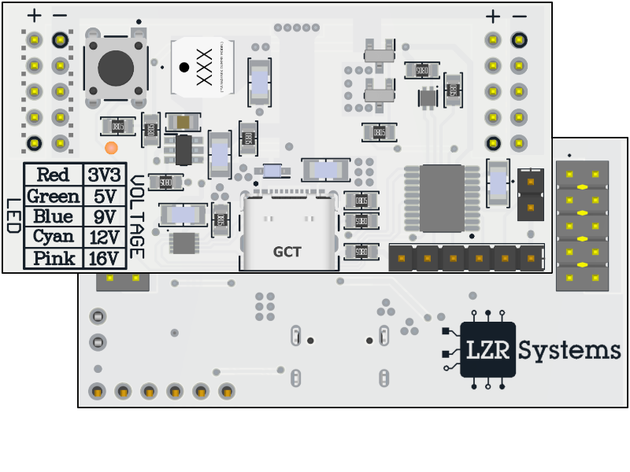
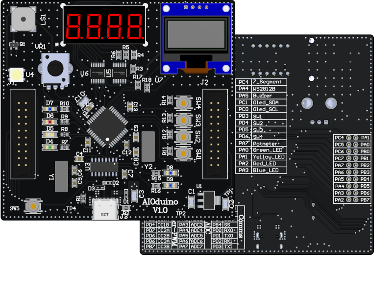
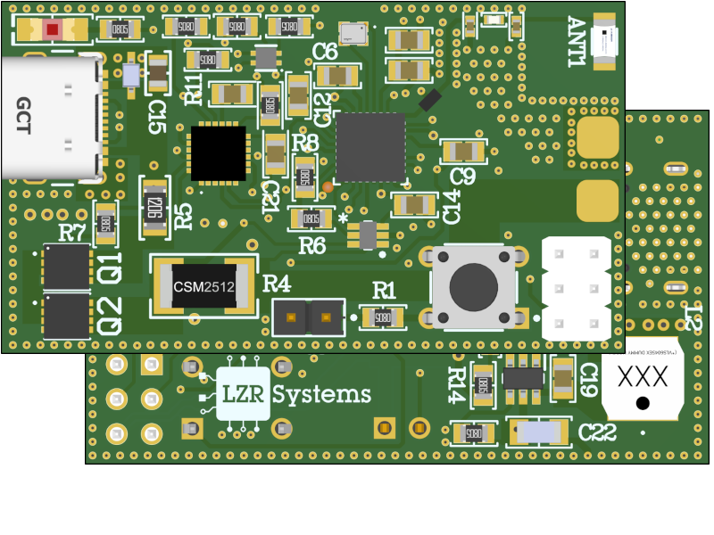
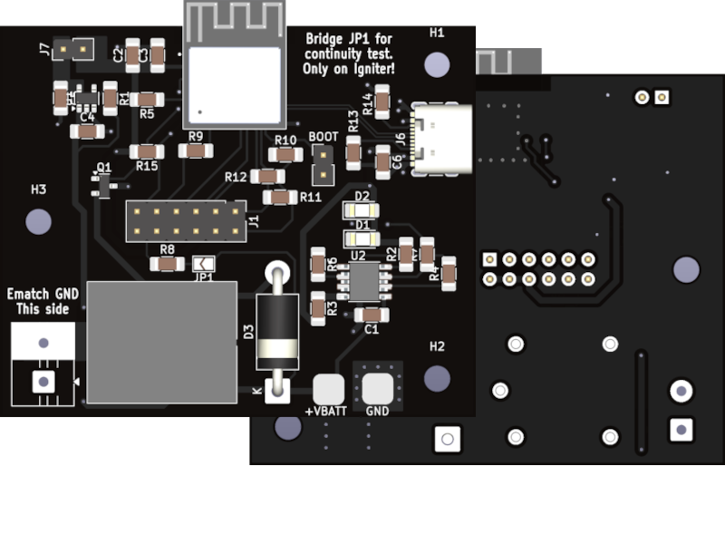
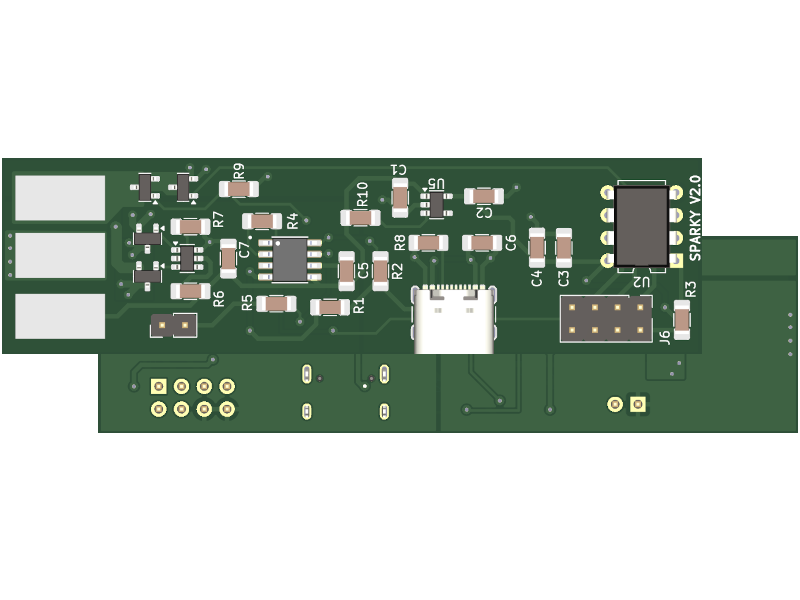

# Embedded systems and hardware design projects by Lázár Sándor
> This site is a collection of electronics and embedded systems reference designs.  
> It provides schematics, PCB layouts, and documentation for various projects,  
> intended as a resource for learning, experimentation, and future development.

## :material-folder: [Projects](Projects/index.md)

  

    <!-- Original set -->

    <a href="/Projects/BreadboardPSU/" class="project-card">
      
      <h3>BreadboardPSU</h3>
      
Solderless breadboard compatible PSU

    </a>

    <a href="/Projects/AIOduino" class="project-card">
      
      <h3>AIODuino</h3>
      
ATmega1284P Dev board with peripherals

    </a>

    <a href="/Projects/NANOPSU" class="project-card">
      
      <h3>NanoPSU</h3>
      
BLE enabled Programmable PSU

    </a>

    <a href="/Projects/Launchy" class="project-card">
      
      <h3>Launchy</h3>
      
ESP-NOW based model rocket launch controller

    </a>

    <a href="/Projects/Sparky" class="project-card">
      
      <h3>Sparky</h3>
      
???

    </a>

    <a href="/Projects/TinyPSU" class="project-card">
      
      <h3>TinyPSU</h3>
      
Small form factor CV/CC benchtop power supply

    </a>

    <a href="/Projects/USB3hub" class="project-card">
      
      <h3>USB3.0 Hub</h3>
      
USB-C IN 2xUSB-C 3.0, 2xUSB-A 3.0 OUT

    </a>

    <a href="/Projects/electronic_load" class="project-card">
      
      <h3>Electronic Load</h3>
      
Adjustable Water Cooled Electronic Load

    </a>

    <!-- Duplicate set for seamless loop -->
    <a href="/Projects/BreadboardPSU/" class="project-card">
      
      <h3>BreadboardPSU</h3>
      
Solderless breadboard compatible PSU

    </a>

    <a href="/Projects/AIOduino" class="project-card">
      
      <h3>AIODuino</h3>
      
ATmega1284P Dev board with peripherals

    </a>

    <a href="/Projects/NANOPSU" class="project-card">
      
      <h3>NanoPSU</h3>
      
BLE enabled Programmable PSU

    </a>

    <a href="/Projects/Launchy" class="project-card">
      
      <h3>Launchy</h3>
      
ESP-NOW based model rocket launch controller

    </a>

    <a href="/Projects/Sparky" class="project-card">
      
      <h3>Sparky</h3>
      
???

    </a>

    <a href="/Projects/TinyPSU" class="project-card">
      
      <h3>TinyPSU</h3>
      
Small form factor CV/CC benchtop power supply

    </a>

    <a href="/Projects/USB3hub" class="project-card">
      
      <h3>USB3.0 Hub</h3>
      
USB-C IN 2xUSB-C 3.0, 2xUSB-A 3.0 OUT

    </a>

    <a href="/Projects/electronic_load" class="project-card">
      
      <h3>Electronic Load</h3>
      
Adjustable Water Cooled Electronic Load

    </a>

  

## :octicons-image-16: [Gallery](Gallery.md)

## :fontawesome-solid-download: [Downloads](Downloads.md)

[AIOduino.zip](https://github.com/sanko0112/AIOduino/archive/refs/heads/main.zip)  
[NANOPSU.zip](https://github.com/sanko0112/NANOPSU/archive/refs/heads/main.zip)  
[BreadboardPSU](https://github.com/sanko0112/BreadboardPSU/archive/refs/heads/main.zip)  
[Launchy.zip](https://github.com/sanko0112/Launchy/archive/refs/heads/main.zip)  

## :material-tag-multiple: [Tags](Tags.md)
